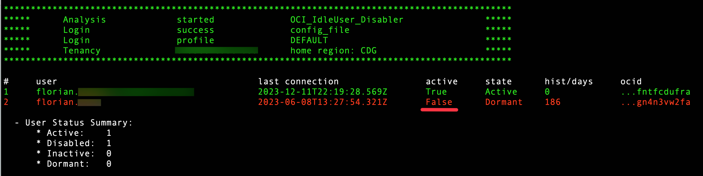

# OCI_IdleUser_Disabler

This script retrieves all users within an OCI IAM Domain. It additionally captures the last connection date for each user. Subsequently, it deactivates users who have not logged in OCI within the specified time frame, which is set to 60 days by default.

This script runs :

- within Oracle Cloud Infrastructure (OCI) CloudShell
- on compute instance with instance_principals authentication
- on compute instance with config_file authentication

## Table of Contents

- [Parameters for execution](#Parameters-for-execution)
- [How to use](#How-to-use)
- [Setup](#Setup)
- [Screenshots](#Screenshots)
- [Disclaimer](#disclaimer)
- [Questions](#questions)


## Parameters for execution:

Default authentication uses [Instance Principals](https://docs.public.oneportal.content.oci.oraclecloud.com/en-us/iaas/Content/Identity/Tasks/callingservicesfrominstances.htm), meaning you can run this script from an OCI virtual machine without having to provide any details or credentials

| Argument      | Parameter            | Description                                                          |
| -----------   | -------------------- | -------------------------------------------------------------------- |
| -cs           |                      | authenticate through CloudShell Delegation Token                     | 
| -cf           |                      | authenticate through local OCI config_file                           | 
| -cfp          | config_file          | change OCI config_file path, default: ~/.oci/config                  | 
| -cp           | config_profile       | indicate config file section to use, default: DEFAULT                | 
| -endpoint     | identity Domain URL  | you must pass the URL of your IAM Domain.                            | 
| -days         | days integer         | number of days of user inactivity, default : 60                      | 
| -dryrun       |                      | evaluate users without deactivating                                  | 

## How to use
##### Default :[Domain URL](https://docs.oracle.com/en-us/iaas/Content/Identity/domains/to-view-details-of-an-identity-domain.htm)
	
	python3 ./OCI_IdleUser_Disabler.py -endpoint https://idcs-28365c5d0XXXXXX.identity.oraclecloud.com:443

without authentication argument ** OCI_IdleUser_Disabler** tries to authenticate using Instance Principals

##### Authenticate with local_config_file:
	
	python3 ./OCI_IdleUser_Disabler.py -cf -endpoint https://idcs-28365c5d0XXXXXX.identity.oraclecloud.com:443

##### Authenticate with custom local_config_file & profile:
	
	python3 ./OCI_IdleUser_Disabler.py -cf -cfp /home/opc/myconfig -cp MyDomain -endpoint https://idcs-28365c5d0XXXXXX.identity.oraclecloud.com:443

##### Authenticate in cloud_shell:
	
	python3 ./OCI_IdleUser_Disabler.py -cs -endpoint https://idcs-28365c5d0XXXXXX.identity.oraclecloud.com:443

##### custom parameters examples:
	
	python3 ./OCI_IdleUser_Disabler.py -cf -days 180 -dryrun -endpoint https://idcs-28365c5d0XXXXXX.identity.oraclecloud.com:443
	

# Setup

If you run this script from an OCI compute instance you should use the default authentication method: [Instance Principals](https://docs.public.oneportal.content.oci.oraclecloud.com/en-us/iaas/Content/Identity/Tasks/callingservicesfrominstances.htm).

Using Instance Principals, you must create the following resources:

##### Create a Dynamic Group

- Create a Dynamic Group called OCI_Scripting and add the OCID of your instance to the group, using :

```
ANY {instance.id = 'OCID_of_your_Compute_Instance'}
```	

##### Create a Policy

- Create a policy in the root compartment, giving your dynamic group the permissions to manage users in tenancy:

```
allow dynamic-group 'Your_Identity_Domain_Name'/'OCI_Scripting' to manage users in tenancy
```

##### Download script locally

```
git clone https://github.com/Olygo/OCI_IdleUser-Disabler
```

# Screenshots

##### Domain with Dormant user enabled :


##### Run script with -dryrun first :


##### Run script without -dryrun => will disable dormant users :


##### Rerun script to show disabled users :


##### Check disabled users in the console:


## Questions ?
**_olygo.git@gmail.com_**

## Disclaimer
**Please test properly on test resources, before using it on production resources to prevent unwanted outages or unwanted bills.**
